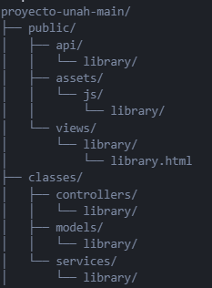
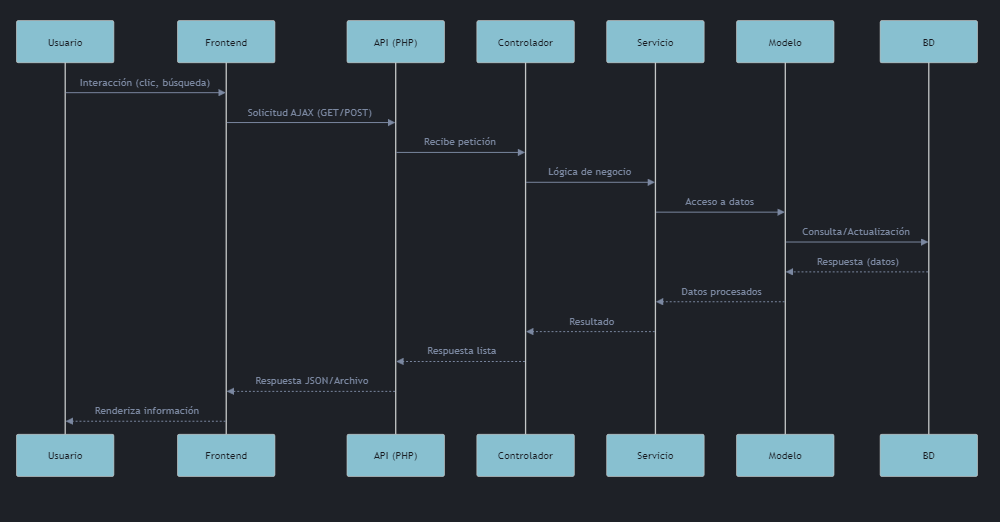

# Esquema Técnico de la Biblioteca

## 1. Estructura de Carpetas





---


## 2. Diagrama de Flujo de Peticiones

  


## 3. Relación de Archivos Clave

- **library.html**: Vista principal.
- **crudFile.js, loadFiles.js, endpoints.js, etc.**: Scripts para consumir la API y manipular la vista.
- **Controladores PHP**: Reciben las peticiones, validan y llaman a los servicios.
- **Servicios PHP**: Lógica de negocio (Realiza validaciones, cálculos, reglas, etc.), interacción con modelos.
- **Modelos PHP**: Acceso a la base de datos.

---

## 4. Ejemplo de Código: Controlador y Servicio

### Controlador (BookController.php)

```php
// ... existing code ...
require_once '../../services/library/listBooks.php';

class BookController {
    public function listarLibros() {
        $servicio = new ListBooksService();
        return $servicio->obtenerLibros();
    }
}
// ... existing code ...
```

### Servicio (listBooks.php)

```php
// ... existing code ...
require_once '../../models/library/Book.php';

class ListBooksService {
    public function obtenerLibros() {
        $bookModel = new Book();
        return $bookModel->getAllBooks();
    }
}
// ... existing code ...
```

### Modelo (Book.php)

```php
// ... existing code ...
class Book {
    public function getAllBooks() {
        // Lógica para consultar la base de datos y devolver los libros
    }
}
// ... existing code ...
```

---

## 5. Estructura de Datos

### Libro

```json
{
  "id": 1,
  "titulo": "Nombre del libro",
  "autor": "Autor",
  "tipo": "Libro",
  "etiquetas": ["Ciencia", "Educación"],
  "archivo": "ruta/al/archivo.pdf"
}
```

---

## 6. Seguridad

- Controlar permisos de usuario.
- Manejar errores y respuestas adecuadas.

---
